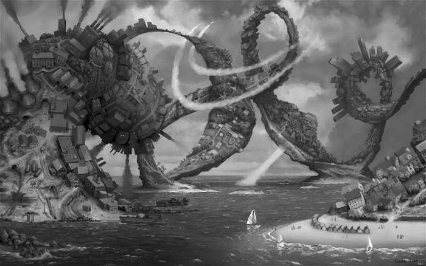
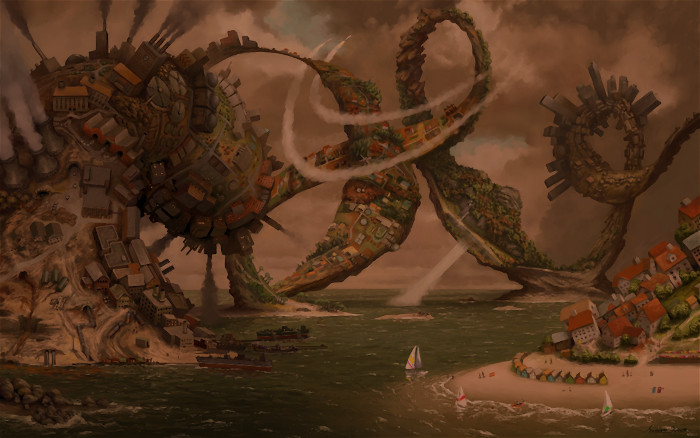
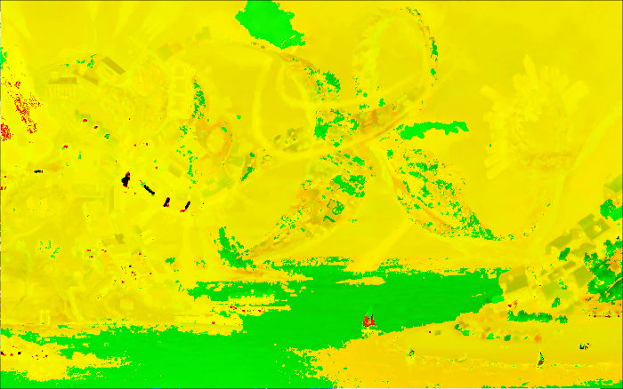
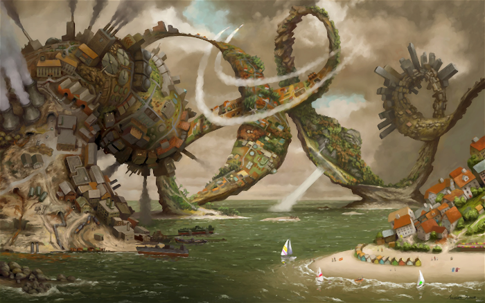

# Image Editor
A program for applying different filters to .ppm images implemented in Visual Studio as part of my 3rd semester C++ course project.

## Usage
Open solution in Visual Studio and run providing the necessary command arguments. Example command arguments and screenshots for each filter are shown below. It is possible to process mutiple filters at once.

## Screenshots of filter outputs

### Input image:

### Local filters
1. Gray (-f gray image01.ppm):

2. Color (-f color 0.7 0.5 0.4 image01.ppm): \
You can set the RGB values.

### Neighborhood Filters
1. Blur (-f blur -f blur image01.ppm): \
I applied the blur filter two times to blur the image more.

### Sorting Filters
1. Diff (-f diff image01.ppm):

2. Median (-f median image01.ppm): \
\ Median is good for denoising so the image didn't change much.

### Multiple filters example:
(-f gray -f color 0.4 0.5 0.7 -f blur -f blur -f blur image01.ppm) \

